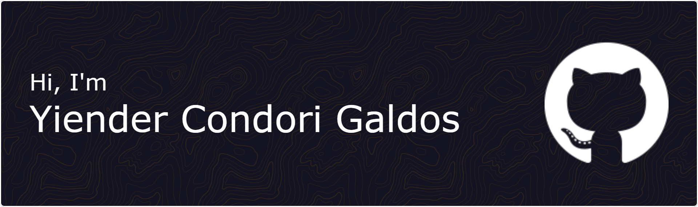

<!-- Gif -->

    </a>

<!-- Banner -->

    </a>

<!-- Presentacion -->
<h2 align="center">
  <b>📌About me</b>
</h2>

<!-- Mostrar profile update -->

   
    

#### Hello, hope you all have good day!!

- I ❤️ to learn, develop and experiment with programs and awesome things on internet.

- I ❤️ to watch movies, read, play videogames and see nature.

- I ❤️ connecting with new people and sharing ideas, so feel free to reach out to me.

 
<!--
**Jinder2050/Jinder2050** is a ✨ _special_ ✨ repository because its `README.md` (this file) appears on your GitHub profile.

Here are some ideas to get you started:

- 🔭 I’m currently working on ...
- 🌱 I’m currently learning ...
- 👯 I’m looking to collaborate on ...
- 🤔 I’m looking for help with ...
- 💬 Ask me about ...
- 📫 How to reach me: ...
- 😄 Pronouns: ...
- ⚡ Fun fact: ...
-->
 

 <!-- Tecnologias -->
 <h2 align="center">
  <b>💻 Technologies</b>
</h2>

    </a>
    </a>
    </a>
    </a>
    </a>
    </a>
    </a>
    </a>

 

<!-- Analitycs -->
 <h2 align="center">
  <b>⚙ Github Analytics</b>
</h2>

 

 

<!-- Contacto -->
 
<h2 align="center">
  <b>📞 Contact</b>
</h2>

        
        
        

 

<!-- snake -->
 
 

